<div align="center">

</div>


<p align="center">
  <a href="#"><a>
  <a href="#"><a>
  <a href="#"><a>
  <a href="#"><a>
</p>


<a href="https://www.youtube.com/@TeamBees2025">

---


# Table of Contents

<details open>
<summary><h3>Team</h3></summary>

- [Team Members](#team-members)  
- [Team Photo](#team-photo)

</details>

---

<details>
<summary><h3>Hardware & Build</h3></summary>

- [Complete Construction Manual](#complete-construction-manual)  
- [Machinery & Components](#machinery)  
- [Robot/Car Design Overview](#robotcar-design-overview)  
- [Assembly Gallery](#assembly-gallery)

</details>

---

<details>
<summary><h3>Power & Mobility</h3></summary>

- [Power Management](#power-management)  
  - [Battery](#battery)  
  - [Electrical Wiring](#electrical-wiring)  
- [Mobility Management](#mobility-management)  
  - [Chassis](#chassis)  
  - [Drive System](#drive-system)  
  - [Motor](#motor)  
  - [Electronic Speed Controller (ESC)](#electronic-speed-controller-esc)  
  - [Steering](#steering)  
  - [Servo Motor](#servo-motor)

</details>

---

<details>
<summary><h3>Sensors & Perception</h3></summary>

- [Sense Management](#sense-management)  
- [Camera](#camera)  
- [IMU](#inertial-measurement-unit-imu)  
- [LiDAR](#lidar)

</details>

---

<details>
<summary><h3>Software</h3></summary>

- [Frameworks](#software)  
  - [Python 3.0](#python-30)  
  - [ROS 2 Humble](#ros2-humble)  
- [Libraries](#libraries)  
  - [Picamera2](#picamera2)  
  - [OpenCV](#opencv)  
  - [cv_bridge](#cv_bridge)  
  - [Time](#time)  
  - [Numpy](#numpy)  
  - [ROS Robot Controller SDK](#ros_robot_controller_sdk)

</details>

---

<details>
<summary><h3>WRO Challenges</h3></summary>

- [Open Challenge](#open-challenge)  
- [Obstacle Challenge](#obstacle-challenge)

</details>


---

## Our Coach
*Insert photo HERE DIDDY*

A special thanks goes out to our amazing coach, who has been the foundation of our journey. He not only introduced us to ROS2, but was also the first person to open our eyes to the WRO Future Engineers competition and the broader world of robotics. 

## Team Members

<table width="100%" style="border:2px solid #FFC107; border-radius:12px; margin:12px 0;">
  <tr>
    <td width="28%" align="center" style="padding:12px; border-right:6px solid #111;">
      
    </td>
    <td width="72%" style="padding:12px 16px;">
      <h3 style="margin:0 0 6px 0;">Ryan</h3>
      <div><b>Role:</b> Documenter/Programmer</div>
      <div><b>Strengths:</b> Writing, Hardworker.</div>
      <p style="margin-top:8px;">
        <b>About Me:</b> Hi! I'm Ryan. I'm 14, I love to write, play badminton, listen to music, and travel. I've been involved in robotics for nearly a decade and participated in both FLL and WRO Robo Mission. I also have a 4-year-old golden retriever 😊.
      </p>
    </td>
  </tr>
</table>

<table width="100%" style="border:2px solid #FFC107; border-radius:12px; margin:12px 0;">
  <tr>
    <td width="28%" align="center" style="padding:12px; border-right:6px solid #111;">
      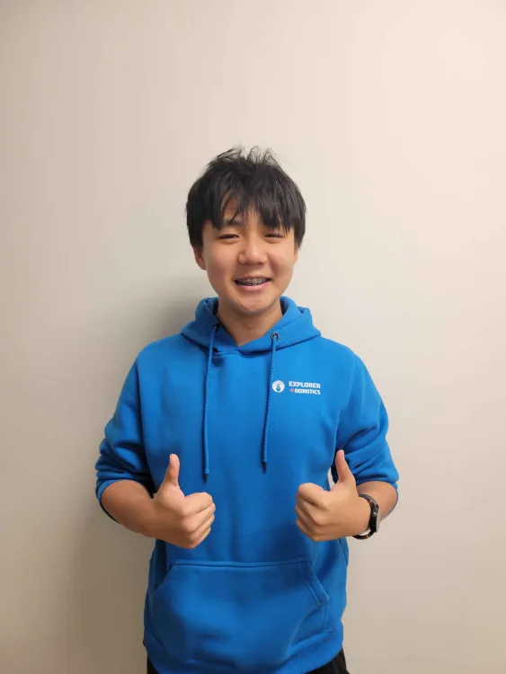
    </td>
    <td width="72%" style="padding:12px 16px;">
      <h3 style="margin:0 0 6px 0;">Elvis</h3>
      <div><b>Role:</b> Builder/Programmer</div>
      <div><b>Strengths:</b> CAD, Fabrication, Team Player, Hardworker.</div>
      <p style="margin-top:8px;">
        <b>About Me:</b> Hi, my name is Elvis. I'm 14. I enjoy building and 3D modeling various objects with Fusion 360. I've been with Explorer Robotics ever since I was 8 years old, and I love to work and play Clash Royale.
      </p>
    </td>
  </tr>
</table>

<table width="100%" style="border:2px solid #FFC107; border-radius:12px; margin:12px 0;">
  <tr>
    <td width="28%" align="center" style="padding:12px; border-right:6px solid #111;">
      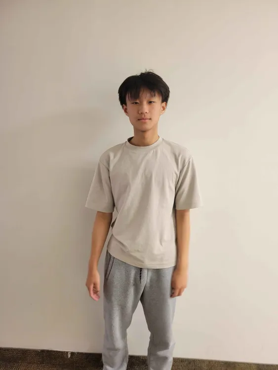
    </td>
    <td width="72%" style="padding:12px 16px;">
      <h3 style="margin:0 0 6px 0;">Harry</h3>
      <div><b>Role:</b> Programmer/Documenter</div>
      <div><b>Strengths:</b> Python, Problem Solver, Patience, Hardworker.</div>
      <p style="margin-top:8px;">
        <b>About Me:</b> Hey! I'm Harry. I've been coding for over half a decade and enjoy swimming, having competed in various swimming competitions. I also like to play badminton.
      </p>
    </td>
  </tr>
</table>


</br>

## Introduction
Team Bees is a group of high-school students from Ontario, Canada, passionate about robotics and self-driving technologies. Our car was designed and programmed to complete both the Open and Obstacle Challenges of WRO 2025 Future Engineers. After only placing 5th in Ottawa Nationals, we advanced to Panama Internationals, representing our country.

Our objective is to design a low-cost, fully autonomous miniature car using accessible components and open-source software, integrating vision, IMU, and LiDAR for perception and ROS 2 Humble for system control.

# Team Photo

<table width="100%" style="border:2px solid #FFC107; border-radius:12px; margin:8px 0;">
  <tr>
    <td align="center" style="padding:14px;">
      <div style="border:2px dashed #FFC107; border-radius:10px; padding:24px; height:320px; display:flex; align-items:center; justify-content:center;">
        <b>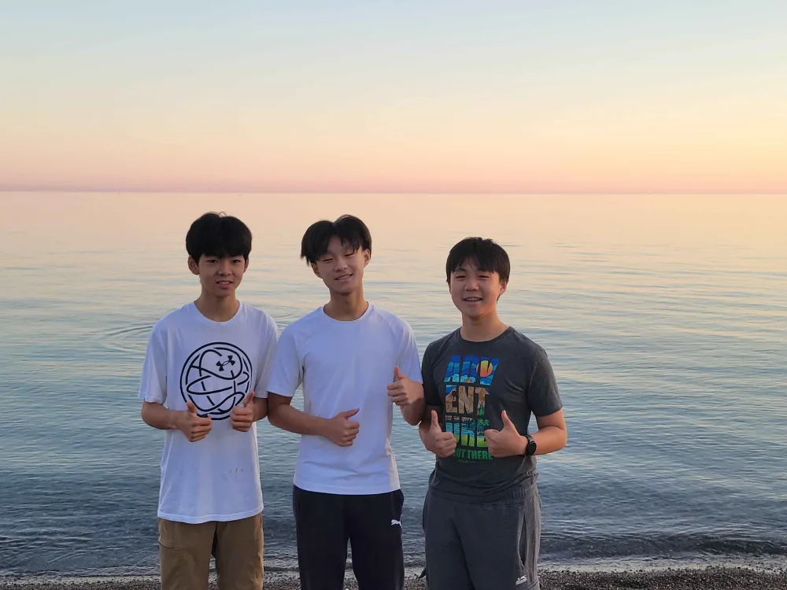</b>
      </div>
      <div style="margin-top:8px; color:#444;"><em>Team Bees — WRO 2025 Future Engineers (Nationals → Panama)</em></div>
    </td>
  </tr>
</table>

</div>

---

</br>

## Complete Construction Manual


The WRO Future Engineers is a competition for self-driven vehicles. Students in the 15- to 19-year-old age group need to design a model of a car, equip it with electromechanical components, and program it so that it can drive autonomously on the track, avoiding obstacles.

More details about the competition can be found on [the official site of WRO Association](https://wro-association.org/competition/2025-season/#rules).

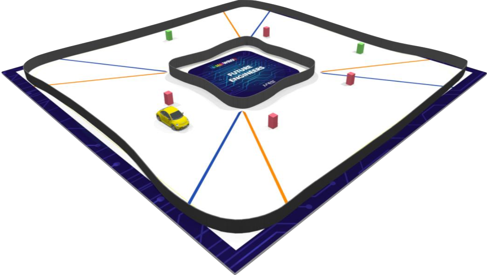


The materials are intended to be built with the [Mkdocs](https://www.mkdocs.org/) site generator.

The example of the site is accessible at https://world-robot-olympiad-association.github.io/future-engineers-gs/.

</br>

---

</br>

## Machinery 
### Components
| Name | Product | Price (CAD)|
| ----------- | ----------- | ----------- |
| RC Car | [`ACXWA CD`](https://www.aliexpress.com/item/1005007495175639.html?src=bing&aff_short_key=UneMJZVf&aff_platform=true&isdl=y&albch=shopping&acnt=135095331&isdl=y&albcp=555018171&albag=1299623888131540&slnk=&trgt=pla-4584826057944442&plac=&crea=81226548307861&netw=o&device=c&mtctp=e&utm_source=Bing&utm_medium=shopping&utm_campaign=PA_Bing_CA_PLA_PC_Hot-Sale_MaxValue_20240715&utm_content=Hot%20sale&utm_term=1%2F28%20car%20chassie&msclkid=b27792305716194d30fcf5a6c0fef479)  | $27 |
| RC Car Battery | [`Gens Ace 1300mAh Battery`](https://genstattu.com/gens-ace-1300mah-2s-7-4v-45c-g-tech-lipo-battery-pack-with-deans-plug/?srsltid=AfmBOoo-qPXzcxuH2dIqTfVYg5ghG9WdKi2b53X-R9M8j3XF_JQlLKJL) | $20.6 | 
| Drive Motor | [`Furitek Micro Komodo 1212 3450KV Brushless Motor`](https://furitek.com/products/furitek-micro-komodo-1212-3456kv-brushless-motor-with-15t-steel-pinion-for-fury-wagon-fx118) | $35 |
| Servo Motor | [`HS-5055MG 11.9g Metal Gear Digital Micro Servo`](https://hitecrcd.com/hs-5055mg-economy-metal-gear-feather-servo/?srsltid=AfmBOooq_9U4Nehv90Y-tGWqZeo6_1c0_7imuMD9W_dBJmYS1m0sd2Y_) | $25 |
| ESC | [`Furitek Lizard Pro 30A/50A ESC`](https://furitek.com/products/combo-of-furitek-lizard-pro-30a-50a-brushed-brushless-esc-for-axial-scx24-with-bluetooth). | $80 |
| Camera | [`5MP 1080P HD Camera with OV5647 Sensor`](https://www.amazon.ca/dp/B0D324RKRZ?ref=ppx_yo2ov_dt_b_fed_asin_title) | $35 |
| Raspberry Pi 5 8GB | [`Raspberry Pi 5`](https://www.amazon.ca/RasTech-Raspberry-Pi-refroidisseur-inclus/dp/B0DQX6JPVM/ref=sr_1_1_sspa?dib=eyJ2IjoiMSJ9.hjnwoY6Di307ZP-ZXjYU_AmgdoLMC7RS47PGeKtJmhqRtp_k-4b8vYkHuUVwKECxKvsLZj0iaGIogN3I9EAYbOkkLP1mmeFujPf3GbJ2CMFnLyrk19mzn-ImTWQS0CIHPOqaTKx-Ctd1F3jpptYNuSYsMmNl7eHo3YlLS2jAkPG1yBTzWywAtMLtqPDw7h7ECNBYaTd1mWMee3tTjRJN-xMqYHvdCTQPK7nYLTwDF-fwzPk8SNqpdFTZ5PaxoJsqiCrI71GJKbHEhh34FjN7lpqwol6Q_mREib5Uh598Ms4.l7oHUekQqBFhZC9q36eu2RnnsxuvyE01mn0uqJH1tZQ&dib_tag=se&gad_source=1&hvadid=668188233052&hvdev=c&hvexpln=0&hvlocphy=9000756&hvnetw=g&hvocijid=14781734050545810589--&hvqmt=e&hvrand=14781734050545810589&hvtargid=kwd-916491466264&hydadcr=24946_13702398&keywords=raspberry+pi+5+8gb&mcid=370191aac5dd30dfa56c4c13736323b1&qid=1757276490&sr=8-1-spons&sp_csd=d2lkZ2V0TmFtZT1zcF9hdGY&psc=1) | $170 |
| Expansion Board | [`RRC Lite Controller`](https://www.hiwonder.com/products/rrc-lite?srsltid=AfmBOoqZuQkdiCruulYju-KXoSowMik5Ov_Vs3-_8TA4Bm_luvoK6Oxn). | $40 |
| Switch | [`DaierTek ON Off Round Rocker Switches`](https://www.amazon.ca/DaierTek-Listed-Switches-Automotive-KCD1-5Pack/dp/B07S1MV462/ref=asc_df_B07S1MV462?mcid=7da2a9b953e93162885adff341695ef6&tag=googleshopc0c-20&linkCode=df0&hvadid=706726017537&hvpos=&hvnetw=g&hvrand=8977619187557058444&hvpone=&hvptwo=&hvqmt=&hvdev=c&hvdvcmdl=&hvlocint=&hvlocphy=9000756&hvtargid=pla-813471950103&hvocijid=8977619187557058444-B07S1MV462-&hvexpln=0&gad_source=1&th=1). | $2.6 |
| Wheels | [`Abendor 6 Spoke Wheel Rims`](https://www.amazon.ca/Abendor-Spoke-Narrow-Aluminum-Wltoys/dp/B09ZYVGYB4?th=1). | $31.6 |


*Note: The switch is $13 for 5. 13/5 = 2.6.*

**Total:** $466.8 *No Tax*

**With Tax:** $527.48

</br>

---

## 3D Design and Fabrication

|  |
|:--:|
| *Fully 3D printed design, every component made in-house* |

### Overview  
3D printing played a key role in our project, allowing us to design, prototype, and refine custom mechanical parts with precision and speed.  
All major structural components — including the LiDAR mount, steering system, and motor mechanism — were modeled in Fusion 360 and fabricated using a PS1 Bambu Lab printer with PLA filament.  
The ability to produce rapid design iterations helped us fine-tune geometry, fit, and strength throughout testing.

---

### Printing Parameters  

| Setting | Value |
|----------|--------|
| Printer | PS1 Bambu Lab |
| Material | PLA |
| Layer Height |  |
| Infill Density |  |
| Print Speed |  |
| Nozzle Diameter |  |

---

### Why We Chose PLA  

| Material | Strength | Heat Resistance | Printability | Availability | Notes |
|:--:|:--:|:--:|:--:|:--:|:--|
| PLA | Medium | Low | Very Easy | Widely Available | Ideal for prototypes and low-stress components. Excellent surface finish and easy to reprint. |
| PETG | High | Medium | Moderate | Common | Stronger and more flexible, but harder to print cleanly. Useful for parts under stress. |
| ABS | High | High | Difficult | Common | Better heat resistance, but warps easily and requires a heated enclosure. |
| Nylon / CF-Nylon | Very High | High | Difficult | Limited | Excellent strength and flexibility, but expensive and requires high-end printers. |

</br>

PLA was chosen for its ease of use, low cost, and availability, allowing quick iteration without sacrificing accuracy.  
It provided reliable performance for our robot, where temperature resistance and high flexibility were not critical factors.  


---


</br>

## Assembly Gallery

<table>
  <!-- Row 1 -->
  <tr>
    <td align="center" style="border:1px solid #ddd; padding:15px;">
    <br/>
      <em><strong>Front View</strong><br>Shows the overall profile and front-facing components.</em>
    </td>
    <td align="center" style="border:1px solid #ddd; padding:15px;">
      <br/>
      <em><strong>Rear View</strong><br>Shows the drive wheels and rear motor assembly.</em>
    </td>
    <td align="center" style="border:1px solid #ddd; padding:15px;">
     <br/>
      <em><strong>Top View</strong><br>Shows the layout of all major components on the upper chassis.</em>
    </td>
  </tr>
  <!-- Row 2 -->
  <tr>
    <td align="center" style="border:1px solid #ddd; padding:15px;">
     <br/>
      <em><strong>Left Side View</strong><br>Shows the side profile and left-side components.</em>
    </td>
    <td align="center" style="border:1px solid #ddd; padding:15px;">
      <br/>
      <em><strong>Right Side View</strong><br>Shows the side profile and right-side components.</em>
    </td>
    <td align="center" style="border:1px solid #ddd; padding:15px;">
      <br/>
      <em><strong>Bottom View</strong><br>Shows the underside, wheel mounting, and lower chassis.</em>
    </td>
  </tr>
</table>

</br>

---
</br>


# Mobility Management
This section covers and houses all components that help or allow or robot to move and steer. It includes the steering system for directional control, the electronic speed controller (ESC) to manage motor power, the main motor for movement, a servo motor for precise adjustments like steering, and the chassis, which is the base to hold and support all these parts securely.

</br>

## Chassis 


For our build, we selected the **ACXWA CD chassis**, a non-prebuilt frame originally crafted with a modular design to provide adjustable lengths between 1/28 and 1/24 scale. During development, we redesigned the component connecting the front and rear sections to improve structural stability. This modification locked the chassis into a fixed 1/24 scale (16.2 cm). While adjustable lengths provide flexibility, they introduce structural weakness. Our fixed build removes this weak point, creating a rigid, non-sliding frame.

</br>

### Notable Features / Design Advantages

- **Cost-effective:** At only $27 CAD, the chassis allowed us to remain within budget, compared to typical pre-built chassis costing between $50 and $100+.
- **Motor stand included:** This reduced assembly time and ensured accurate motor alignment, minimizing drivetrain losses and gear misalignment.
- **High steering range:**  Front wheels pivoted significantly, enabling tight turns with less steering input.
- **Compact form factor:** The fixed 1/24 scale size aided a streamlined electronics layout (ESC, battery), reducing clutter and improving airflow for cooling.
</br>

###  Chassis Limitations  

Despite the benefits, the chassis presented several challenges that impacted performance and assembly:  

- **Tire traction:** The stock plastic tires offered almost no grip, which we noticed immediately during testing. On smooth surfaces like the game map, this resulted in uncontrolled wheelspin, unstable acceleration, and extended braking distances.
- **Steering imbalance:** We also observed that the front wheels did not pivot evenly, creating unbalanced turning angles. The turning was unpredictable, and when navigating precise maneuvers, uneven steering made the car difficult to control consistently.
</br>

###  How We Overcame These Limitations  

- **Improved traction:** We replaced stock plastic tires with rubber-coated wheels. 
- **Balanced steering:** Designed and 3D-printed a custom steering system, succeeding our previous unequal one.

</br>

### New Wheels
<div align="center">

<table>
  <tr>
    <td style="border: 200px solid black; padding: 5px;">
      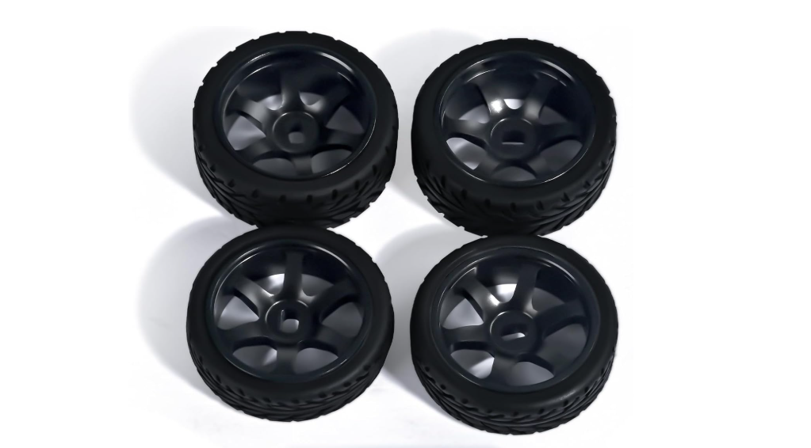
    </td>
  </tr>
</table>

</div>

<p><strong>Where to Buy:</strong> <a href="https://www.amazon.ca/Abendor-Spoke-Narrow-Aluminum-Wltoys/dp/B09ZYVGYB4?th=1" target="_blank">Click Here</a></p>

</br>

The switch to grippier wheels had an immediate effect on the car's performance. With better traction, the vehicle could accelerate harder without losing control. It could also maintain a steady speed through turns. This made handling more predictable, which was especially important for precise tasks like navigating pillars and parking.

The new wheels also improved efficiency. With less energy wasted on wheel slip, the motor’s output went more directly into forward motion. This not only made the car feel faster but also reduced strain on the drivetrain during long runs. As a result, we had a setup that was both quicker and more reliable in competition.

</br>

## Drive System

Our car uses a rear wheel drive (RWD), meaning that motor's power is transmitted to the back wheels rather than the front. This configuration provides many benefits to the car.

</br>

### Benefits
- Better weight distribution. This is because the front wheels handle steering, and the rear wheels help with propulsion, which helps the car remain more balanced during acceleration and turning.
- RWD also provides a stronger grip to surfaces. Since the rear of the robot is heavier, the back wheels get pressed into the ground, providing for more traction and therefore enhancing the grip.
- Since the front wheels are only used for steering, the car can turn more precisely, as there is no motor interference.

</br>

## Furitek Micro Komodo 1212 3450KV Brushless Motor

---

<table>
<tr>
  <td width="35%" valign="top">

  ### Physical Qualities
  | Field          | Value                              |
  |----------------|------------------------------------|
  | **Product Title** | Furitek Micro Komodo 1212 3450KV |
  | **Size**          | 15.5 × 20.6 mm                   |
  | **Weight**        | 17.5 g                           |
  | **Physical State**| Brushless Outrunner (12-slot)    |

  </td>


  <td width="65%" align="center">
    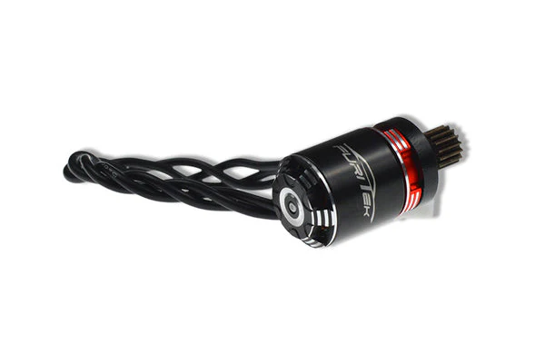<br>
    <em>Furitek Komodo 1212 motor</em>
  </td>
</tr>
</table>

---

<table>
<tr>
<td width="65%" valign="top">

### Reasoning of Purchase
Following a review of suitable brushless options, we selected the Furitek Micro Komodo 1212 3450 KV brushless motor. This motor is compact and lightweight, making it perfect for a small self-driving platform where space and weight impact agility and energy use. Its 12-slot, multipole design distributes torque more evenly during rotation. This results in less cogging, smoother throttle response, and better control at low speeds.

---

### Potential Improvements
- Replace plastic gears with metal gears to withstand sustained, high-speed usage.
- Experiment with 10 : 58 – 14 : 58 combinations to tune the balance between torque and top speed.
- Upgrade or lubricate bearings to reduce friction and improve consistency over multiple heats.
  
</br>

</td>

<td width="35%" valign="top">

### Performance Specifications
- KV: **3450 rpm/V**  
- No-load @10V: **0.7 A**  
- Power: **120 W**  
- Battery: **2–3S LiPo**  
- Resistance: **0.16 Ω**  
- Max Current: **10 A**  
- Slot/Pole: **12**  
- Shaft: **1.5 × 6 mm**  

</td>
</tr>
</table>

---


<p><strong>Where to Buy:</strong> <a href="https://furitek.com/products/furitek-micro-komodo-1212-3456kv-brushless-motor-with-15t-steel-pinion-for-fury-wagon-fx118" target="_blank">Click Here</a></p>

</br>

To secure the motor to the chassis, we 3D printed a motor mechanism with a slot designed to fit the motor's axle.

</br>

| 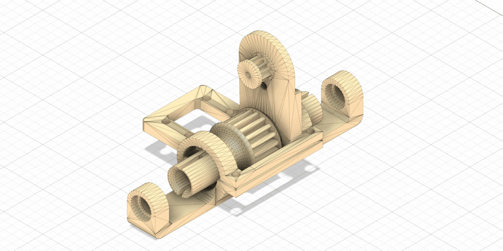 |
|:--:|
| **Motor Mechanism** |

</br>

This 3D-printed motor gear mount assembly connects the brushless motor to the drivetrain using a fixed spur gear reduction system. The motor’s pinion drives a larger spur gear on the output shaft, which reduces speed and increases torque. The mount has a sturdy motor plate, gear supports that fit bearings, and a reinforced base that keeps both shafts aligned. This setup ensures smooth power transfer and consistent gear meshing. The design reduces energy loss and mechanical vibration from misalignment while remaining lightweight and compact. 

### Potential Improvements
- Implement a stronger motor holder to cut down on vibration and improve stability when it's under load.
- Explore different motor designs to improve performance and reduce weight.


## Electronic Speed Controller (ESC)  
The ESC is a key component that regulates how the motor receives power. It:  
- Controls the motor's speed  
- Manages direction  
- Ensures safe delivery of voltage and current to the motor

This ESC was chosen for its high current capacity, lightweight design, and reliable built-in BEC, making it well-suited for our motor and servo needs.

</br>

<table border="1" width="100%" style="font-size:20px; text-align:left;">
  <tr> 
    <td width="50%" align="center" style="vertical-align:top;"> 
      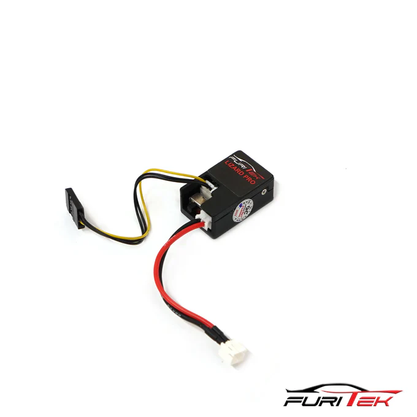 
    </td> 
    <td width="50%" valign="top" style="vertical-align:top; font-size:20px;"> 
         <h2 style="font-size:28px;">Furitek Lizard Pro 30A/50A ESC</h2> 
      <ul>
        <li><strong>Battery Support:</strong> 2S–3S LiPo</li> 
        <li><strong>BEC:</strong> 5V or 6.5V, 2.5A</li> 
        <li><strong>Constant Current:</strong> 30A</li> 
        <li><strong>Burst Current:</strong> 50A</li> 
        <li><strong>Built-in Power Switch</strong></li> 
        <li><strong>Dimensions:</strong> 28 × 15.5 mm</li> 
        <li><strong>Weight:</strong> 3.7 g</li> 
      </ul> 
    </td> 
  </tr> 
</table>

<p><strong>Where to Buy:</strong> <a href="https://furitek.com/products/combo-of-furitek-lizard-pro-30a-50a-brushed-brushless-esc-for-axial-scx24-with-bluetooth" target="_blank">Click Here</a></p>


</br>

---

## Servo Motor

This servo motor was chosen for its compact size, strong torque, and durable metal gears, making it great for precise steering control.

</br>

<table border="1" width="100%" style="font-size:20px;">
  <tr>
    <td width="50%" align="center" style="vertical-align:top;">
      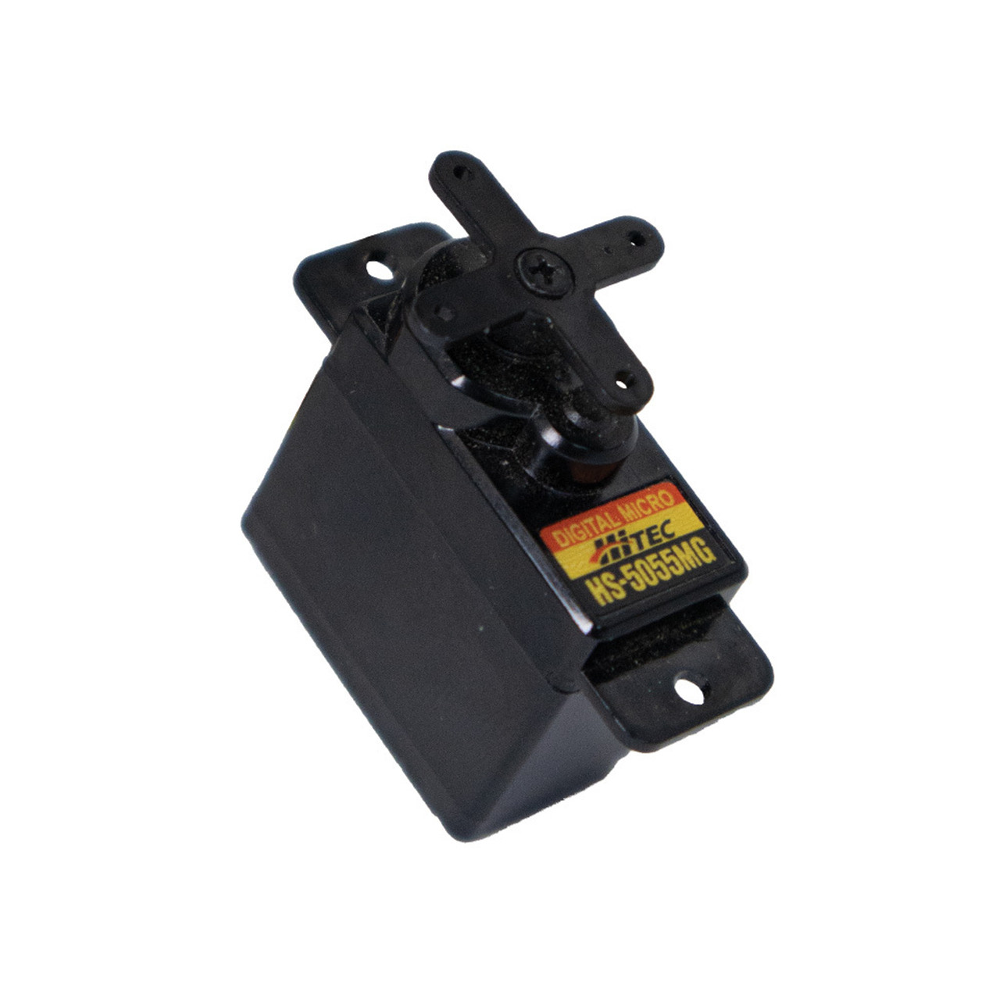
    </td>
    <td width="50%" valign="top" style="vertical-align:top; font-size:20px;">
      <h2 style="font-size:26px;">HS-5055MG 11.9g Metal Gear Digital Micro Servo</h2>
      <ul>
        <li><strong>Operating Voltage:</strong> 4.8V – 6.0V DC</li>
        <li><strong>Max Torque:</strong> 22 oz/in (1.6 kg/cm)</li>
        <li><strong>Speed:</strong> 0.17s/60° @ 6.0V</li>
        <li><strong>Stall Current:</strong> 700 mA</li>
        <li><strong>Gear Material:</strong> Metal</li>
        <li><strong>Weight:</strong> 9.5 g</li>
        <li><strong>Circuit Type:</strong> G1 Programmable Digital</li>
      </ul>
    </td>
  </tr>
</table>

<p><strong>Where to Buy:</strong> <a href="https://hitecrcd.com/hs-5055mg-economy-metal-gear-feather-servo/?srsltid=AfmBOooq_9U4Nehv90Y-tGWqZeo6_1c0_7imuMD9W_dBJmYS1m0sd2Y_" target="_blank">Click Here</a></p>

</br>

### Potential Improvements
- Improve response time. This servo motor is not as quick as higher-end micro servos, which reduces steering precision during sharp turns.
- Upgrade to a higher-torque digital micro servo for more reliable steering.

</br>

## Steering
Our prototype used a commercial chassis. We quickly found that the steering system was inefficient and turned unevenly. To fix this, we built a completely new steering system from scratch, 3D-printing all the components for the precise and balanced control we needed. We developed two different steering designs. The first design includes a mounting frame that attaches the system to the chassis, a servo linkage arm that connects directly to the servo motor, and steering knuckles. However, the second design showed more potential. After testing, it performed better than the first design. This design features an antisway arm, steering knuckles, and a control arm, offering a more consistent turn, easier assembly, and greater durability.
</br>


</br>

### Key Improvements Over Stock Design
1. **Symmetry in Motion** – Both left and right wheels now turn at equal angles, reducing understeer/oversteer imbalance.  
2. **Reduced Backlash** – By using strong linkages and tightly toleranced 3D-printed parts, uncontrolled movement is minimized.  
3. **Strength & Durability** – The mounting frame distributes servo torque evenly, reducing wear and preventing chassis flex.  
4. **Precision Control** – The redesigned geometry allows finer servo adjustments to translate directly into steering corrections.
   
</br>

- Add more fillets on corners, reducing stress concentration and preventing cracks.
- Implement brass threaded inserts for screw holes rather than relying on bare plastic.

</br>


### How the Car Moves
When the battery provides power, the ESC manages the electricity sent to the motor. The motor turns this controlled flow of electricity into rotational motion, which makes the car's wheels spin. By changing the voltage and current through the ESC, we can control the car's speed and direction, enabling it to move forward, backward, accelerate, slow down, or reverse.

At the same time, the servo motor handles steering. It changes the angle of the front wheels through the steering system, allowing the car to turn left or right accurately.

---

</br>

# Power Management

</br>

## Gens Ace 1300mAh 2S 7.4V 25C LiPo Battery

---

<table>
<tr>
  <td valign="top" width="35%">

  ### Physical Qualities
  | Field | Value |
  |--------|--------|
  | Product Title | Gens Ace 1300mAh 2S 7.4V 25C LiPo |
  | Size | 70.9 × 35.2 × 14.5 mm |
  | Weight | 90 g |
  | Type | 2S1P LiPo Battery |
  | Connector | T-Style (Battery), G-Tech Smart (Balance) |

  </td>

  <td align="center" width="65%">
    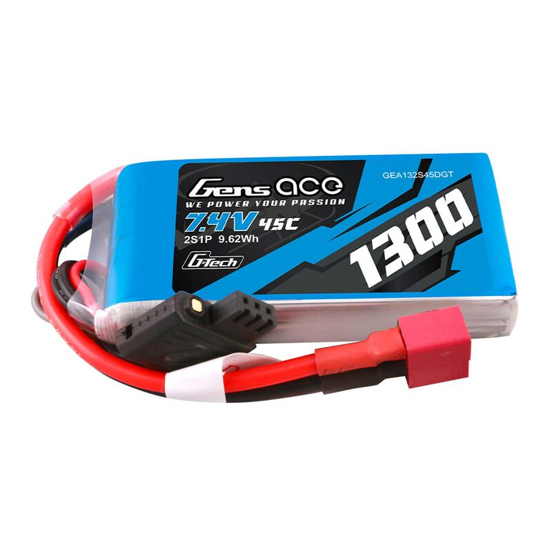<br>
    <em>Gens Ace 1300mAh 2S LiPo Battery</em>
  </td>
</tr>
</table>

---

<table>
<tr>
<td valign="top" width="65%">

### Reasoning of Purchase
We selected the Gens Ace 1300mAh 2S LiPo for its excellent balance between weight, capacity, and current output.  
Its 45C continuous (90C burst) discharge rate provides strong acceleration without noticeable voltage drop.  
The compact design keeps our self-driving car lightweight and well-balanced, ideal for quick maneuvers on WRO courses.  
Its 7.4V rating offers stable power delivery without the extra wear that 3S (11.1V) packs can cause on smaller ESCs and motors.

---

### Potential Improvements
- Increase capacity to 1500–1800mAh for longer runtime between charges.  
- Support faster charging by using a pack with higher C-rate.  
- Add built-in protection for overcharge or over-discharge safety.  

</br>

</td>

<td valign="top" width="35%">

### Performance Specifications
- Voltage: 7.4V (2S)  
- Capacity: 1300mAh  
- Discharge Rate: 45C Continuous / 90C Peak  
- Charge Rate: 5C (6.5A Max)  
- Cell Configuration: 2S1P  
- Watt Hours: 9.62Wh  

</td>
</tr>
</table>

---


<p><strong>Where to Buy:</strong> <a href="https://www.aliexpress.com/item/1005007495175639.html?spm=a2g0o.order_list.order_list_main.11.48a11802NKINMb" target="_blank">Click Here</a></p>

The battery is located at the lowest point of the chassis and is securely attached with Velcro. This setup reduces slippage and helps lower the center of gravity, improving cornering stability.
</br>

### Power Ratings Table
| Component | Voltage | Normal Current Draw | Max Current Draw | Normal Power | Max Power |
|-|-|-|-|-|-|
| 5MP 1080P HD Camera         | 5 V     | 0.16 A   | 0.20 A | 0.80 W  | 1.00 W  |
| RRC Lite Controller         | 5 V     | 0.07 A   | 0.50 A | 0.35 W  | 2.50 W  |
| Furitek Lizard Pro ESC      | 7.4 V   | 0.007 A  | 0.10 A | 0.05 W  | 0.74 W  |
| Furitek Micro Komodo Motor  | 7.4 V   | 0.95 A   | 10.0 A | 7.00 W  | 74.0 W  |
| HS-5055MG Servo Motor       | 5 V     | 0.10 A   | 0.70 A | 0.50 W  | 3.50 W  |
| LDROBOT D500 Lidar          | 5 V     | 0.12 A   | 0.35 A | 0.60 W  | 1.75 W  |
| MicroSD, LEDs, Speakers     | 5 V     | 0.12 A   | 0.30 A | 0.60 W  | 1.50 W  |
| Raspberry Pi 5              | 5 V     | 0.55 A   | 2.00 A | 2.75 W  | 10.0 W  |
| Expansion Board             | 5 V     | 0.12 A   | 0.50 A | 0.60 W  | 2.50 W  |
| Totals                      | —       | —        | —      | ~13 W   | ~97 W   |

</br>

The **Gens Ace 1300 mAh 2S 7.4 V LiPo Battery** offers plenty of power for our car, as shown in the Power Ratings Table. Normally, the car uses about 13 W, which is about 1.7 A from the battery. The car typically draws around 4 W (≈0.5 A) and in short bursts can reach 97 W (≈13 A). The 7.4 V 1300 mAh LiPo has a 45C continuous and 90C peak rating, meaning it can safely supply up to 58.5 A continuously and 117 A in short bursts, far more than the car will ever require. This extra capacity allows the battery to provide stable voltage for the Raspberry Pi, controller, sensors, and peripherals.

</br>


## Electrical Wiring

<div align="center">

<table>
  <tr>
    <td style="border: 200px solid black; padding: 5px;">
      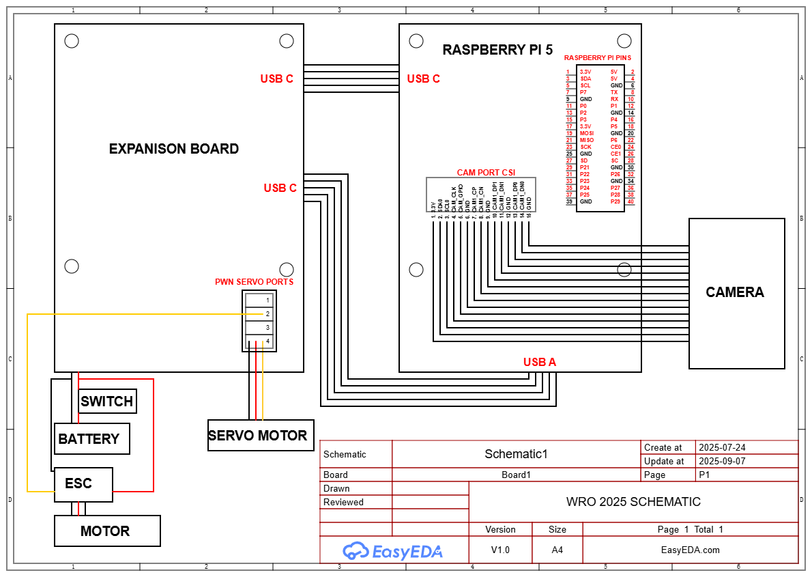
    </td>
  </tr>
</table>

</div>

### Components

- Raspberry Pi 5
- Expansion Board
- Camera
- Servo Motor
- ESC (Electronic Speed Controller)
- Motor
- Battery
- Switch

### Connections

#### Raspberry Pi 5
- **USB-C** ↔ Expansion Board 
- **USB-A** ↔ Expansion Board 
- **CAM PORT CSI** ↔ Camera (15-pin ribbon)

#### Expansion Board
- **PWM Servo Ports**
  
Channel 1 (unused) → Signal | +5V | GND

Channel 2 (ESC) → Signal (ESC) | +5V  | GND

Channel 3 (unused) → Signal | +5V | GND

Channel 4 (Servo) → Signal (Servo) | +5V (Servo) | GND (Servo)

#### Motor Power
Battery (+) → Switch → ESC → Motor
ESC also connects to Expansion Board for monitoring/control

#### Wire Color Codes
*NOTE: Not all wires are color coded*

**Red:** VCC / Positive power
**Black:** GND / Ground
**Yellow:** PWM / Control signal
</br>

---

</br>

# Sense Management

The car relies on various sensors to understand its surroundings and interact safely with the environment. Sense management refers to how these inputs are coordinated, processed, and used for decision-making. Instead of treating each sensor independently, we designed a system that combines all data into a single model of the world. 

At the heart of sense management is the idea of prioritization. Different sensors have different strengths; some are better at detecting precise distances, while others at identifying shapes or movement. By assigning specific roles to each sensor and merging their data, the car maintains a reliable awareness of its environment, even as conditions change.

</br>

## Inertial Measurement Unit (IMU)

While the camera can simultaneously identify different items and surroundings, understanding the car’s own motion and orientation is equally crucial. This is where the IMU comes in. The Inertial Measurement Unit tracks the car’s acceleration, angular velocity, and orientation in real-time, allowing the car to know exactly how it is moving through space. 

</br>

<table border="1" width="100%" style="font-size:20px;">
  <tr>
    <td width="50%" align="center" style="vertical-align:top;">
      
    </td>
    <td width="50%" valign="top" style="vertical-align:top; font-size:20px;">
      <h2 style="font-size:26px;">MPU-6050 6-Axis IMU</h2>
      <ul>
        <li><strong>Sensor Type:</strong> 3-axis Accelerometer + 3-axis Gyroscope</li>
        <li><strong>Accelerometer Range:</strong> ±16g</li>
        <li><strong>Gyroscope Range:</strong>  ±2000°/s</li>
        <li><strong>Resolution:</strong> 16-bit</li>
        <li><strong>Interface:</strong> I²C (up to 400 kHz)</li>
        <li><strong>Supply Voltage:</strong> 3.3V – 5V</li>
        <li><strong>Features:</strong> On-chip DMP, auxiliary I²C bus, built-in temperature sensor, shock tolerant</li>
        <li><strong>Package:</strong> 4×4×0.9 mm QFN</li>
      </ul>
    </td>
  </tr>
</table>

We mainly use the IMU to calculate the number of completed laps.

*Comes with the RRC lite expansion board.*

</br>

### Potential Improvements 
- Upgrade to a 9-axis IMU to add a magnetometer for more precise heading and less drift.
- Replace the old IMU with a higher accuracy one.
- Place the IMU further away from the vibrating motors for increased precision.
</br>

---

|  |
|:--:|
| **Bottom Chassis** |

---

## Camera
This camera was chosen for its wide 175° field of view, compact size, and 5MP resolution, making it ideal for real-time vision processing and object detection on our car.  
</br>

<table border="1" width="100%" style="font-size:20px; text-align:left;">
  <tr> 
    <td width="50%" align="center" style="vertical-align:top;"> 
      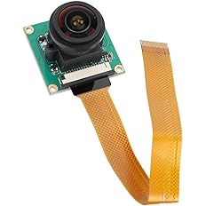
    </td> 
    <td width="50%" valign="top" style="vertical-align:top; font-size:20px;"> 
      <h2 style="font-size:28px;">5/Zero Camera Module (OV5647 Sensor)</h2> 
      <ul>
        <li><strong>Lens Pixel:</strong> 5 MP</li> 
        <li><strong>Resolution:</strong> 2592 × 1944</li> 
        <li><strong>Lens Angle:</strong> 175° Wide Angle</li> 
        <li><strong>Lens Focal Length:</strong> 3.6 mm</li> 
        <li><strong>Focus Mode:</strong> Manual</li> 
        <li><strong>CMOS Size:</strong> 1/2.5 inch</li> 
        <li><strong>Material:</strong> ABS + Optical Glass</li> 
        <li><strong>Screw Model:</strong> M2 × 6</li> 
        <li><strong>Cable:</strong> 15 cm Ribbon Cable</li> 
      </ul> 
    </td> 
  </tr> 
</table>

<p><strong>Where to Buy:</strong> <a href="https://www.amazon.ca/dp/B0D324RKRZ?ref=ppx_yo2ov_dt_b_fed_asin_title" target="_blank">Click Here</a></p>

</br>


The wide-angle camera serves as the car’s primary tool for visual detection. With its 175° lens, the camera captures almost the entire forward field of view, reducing blind spots and enabling the system to track multiple objects simultaneously. This feature proves particularly useful for tasks like pillar and wall detection, identifying obstacles ahead, and observing changes in the environment.

We process the camera feed on the Raspberry Pi using computer programs. This setup allows the car to not only notice when something is in its path but also to identify what it is, such as open passages, furniture, people, or in this case, walls and pillars. This understanding gives the car a significant edge over systems that depend solely on distance sensors.

</br>

---

| 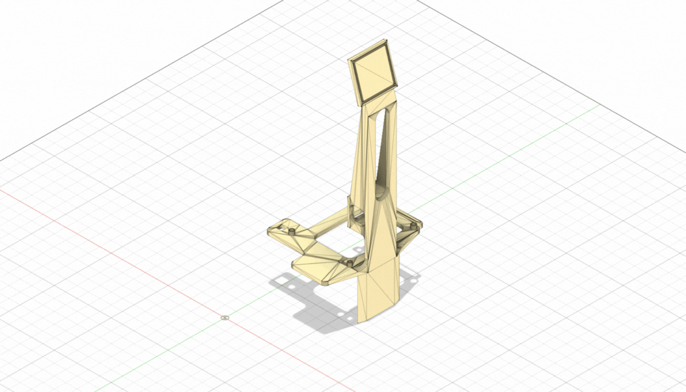 |
|:--:|
| **Top Chassis** |

--- 

### Potential Improvements

While the current Pi Camera provides a good amount of sensing for our obstacle challenge, several improvements could improve performance.

**Camera (5MP Pi Camera w/ OV5647)**
- Upgrade to a higher resolution or global-shutter sensor (e.g., HQ Camera IMX477) for sharper images and less motion blur.  
- Add auto exposure and white balance adjustments to handle changing lighting conditions.    
- Explore infrared capability with an IR-sensitive camera and an IR light source for consistent performance regardless of ambient lighting.  
- Apply filtering in software (e.g., erosion/dilation in OpenCV) or use a moving average/Kalman filter to stabilize pillar tracking.

</br>

### Lidar 

This LiDAR is good for its long-range accuracy, compact design, and robust scanning capability, making it ideal for mapping and obstacle detection in our car.  

<table border="1" width="100%" style="font-size:20px; text-align:left;">
  <tr> 
    <td width="50%" align="center" style="vertical-align:top;"> 
      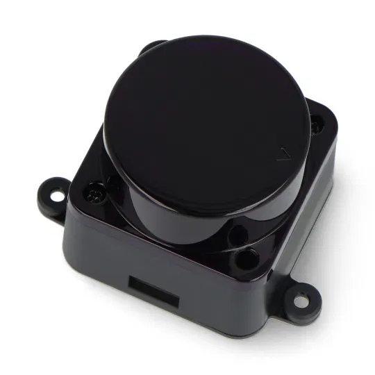 
    </td> 
    <td width="50%" valign="top" style="vertical-align:top; font-size:20px;"> 
      <h2 style="font-size:28px;">LDROBOT D500 LiDAR</h2> 
      <ul>
        <li><strong>Ranging Distance:</strong> 0.03 – 12 m</li> 
        <li><strong>Accuracy:</strong> ±10 mm (0.3–0.5 m), ±20 mm (0.5–2 m), ±30 mm (2–12 m)</li> 
        <li><strong>Scanning Angle:</strong> 360°</li> 
        <li><strong>Scanning Frequency:</strong> 6 – 13 Hz (Typ. 10 Hz)</li> 
        <li><strong>Ranging Frequency:</strong> 5000 Hz</li> 
        <li><strong>Wavelength:</strong> 895 – 915 nm (Typ. 905 nm)</li> 
        <li><strong>Interface:</strong> UART @ 230400 baud</li> 
        <li><strong>Ambient Light Tolerance:</strong> up to 60K Lux</li> 
        <li><strong>Power Supply:</strong> 5 V</li> 
        <li><strong>Power Consumption:</strong> 1.45 W (290 mA)</li> 
        <li><strong>Operating Temperature:</strong> -10 ~ 45 °C</li> 
        <li><strong>Dimensions:</strong> 54 × 46.3 × 35 mm</li> 
        <li><strong>Weight:</strong> 45 g</li> 
      </ul> 
    </td> 
  </tr> 
</table>

</br>

The LiDAR is the car’s most reliable tool for precise distance measurement and mapping. Unlike a camera, which depends on good lighting and struggles to estimate exact distances, the LiDAR provides accurate range data in every direction, up to 12 meters away. This gives the car a real-time 2D map of obstacles and open space. 

---

| 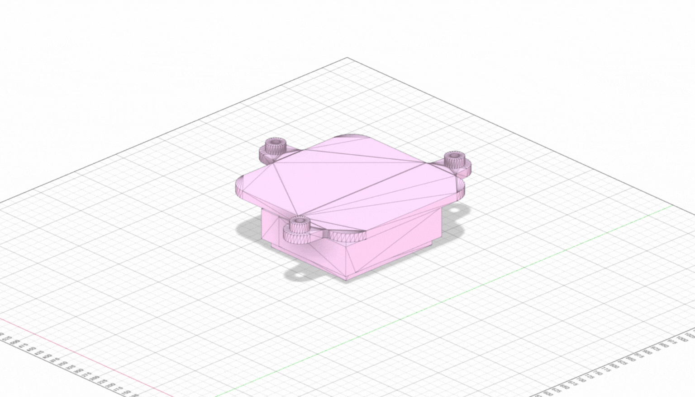 |
|:--:|
| **Lidar Stand** |


</br>


---

</br>

# Software
## Frameworks
### Python 3.0
Python 3 is the core programming language used to build and run the autonomous car logic. Its simplicity, readability, and massive library pool make it ideal for controlling hardware like the Raspberry Pi. For robotics, Python makes it easy to interface with sensors and actuators, process images, and manage logic. However, Python is slower than compiled languages like C++, and because it’s dynamically typed, certain bugs may only appear at runtime if not carefully tested.

### ROS2 Humble 
ROS 2 (Robot Operating System 2) Humble is a modern, open-source robotics middleware designed to enable communication between nodes in robotic systems. It provides tools for message passing to aid with maximizing robot software efficiency. Although efficient, it is difficult and time consuming to incorporate a working ROS2 enviorment into your code. It is for this reason that only the obstacle challenge uses ROS 2 while the open challenge is done with a standalone Python file.
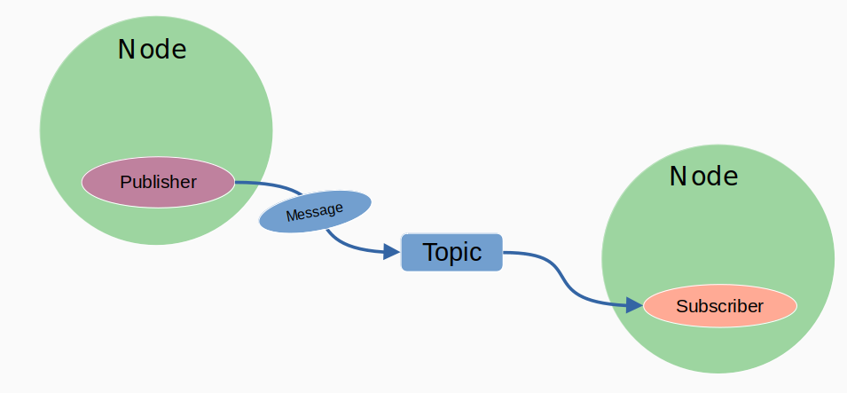


## Libraries
### Picamera2
Picamera2 is a library used to interface with the Raspberry Pi's camera module. It allows the robot to capture real-time photos and videos, which are critical for analyzing the robot environment. It provides full control over resolution, frame rate, and pixel format to effectively work in tandem with OpenCV.

### OpenCV
OpenCV (Open Source Computer Vision Library) is used to process camera frames, apply thresholding, and detect contours within specified regions of interests (ROIs). This data is used to determine the robot's orientation and distance relative to walls and pillars to guide its movement throughout the course.

### Cv_bridge
cv_bridge is a ROS 2 library that converts between ROS Image messages and OpenCV images, enabling image processing with OpenCV in ROS-based applications.

### Time
The built-in Python time module is used for time-based operations, such as delays (sleep) or measuring time elapsed since an event.

### Numpy
NumPy is a fundamental Python library for numerical computation. In robotics, it's often used for handling arrays, matrices, and mathematical operations efficiently. In our code, it is use for creating and handling arrays for color thresholding in HSV space.

### ROS_ROBOT_CONTROLLER_SDK
This custom Python SDK (Software Development Kit) provided by HiWonder is responsible for controlling robot hardware, including steering servos, throttle motors, and RGB LEDs. It turns low-level control into simple methods, allowing the main code to remain clean.

## Open Challenge
### Overview
The Open Challenge is designed to test a robot’s ability to autonomously navigate a closed-loop course using only the black walls as guidance. The robot must detect walls, align itself, make smooth turns at corners, and complete 3 laps without manual intervention in under 3 minutes. The main focus is on path-following and code accuracy.

#### Game Map
<table>
  <tr>
    <td style="border: 200px solid black; padding: 5px;">
      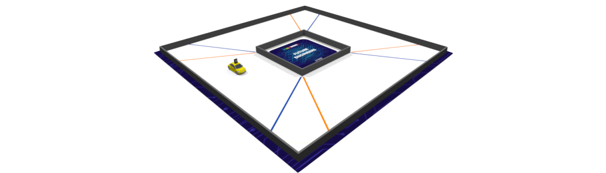
    </td>
  </tr>
</table>

### Difficulties
In the Open Challenge, the course can be set up in either a wide(100cm) or a narrow(60cm) configuration, and each comes with its own difficulties for vision and navigation. 
In the wide setup, the black walls are spaced much farther apart. This makes the robot’s region of interest (ROI) readings weaker because the walls occupy a smaller portion of the camera frame.
The narrow configuration creates the opposite problem. With the walls placed close together, the black regions fill a large portion of the ROIs, making the system very sensitive.

To be successful, the code must be consistent enough to be able to navigate through both scenarios, which each present conflicting issues. Fixing an error in the wide setup may break something in the narrow setup and vice versa.

### Our Solution
The primary means of navigation in the open challenge lies in the camera. The camera captures frames multiple times a second and performs wall following logic with information inside the ROIs. ROIs or region of interests are small rectangles placed strategically in areas of interest, to perform wall detection. The open challenge includes 3 of these ROIs initialized at the top

The left and right ROIs are each placed on the edge of their respective sides. They are essential for the detecton of differences in wall size to do PD steering and detect turn segments. 
The orange ROI is a thin rectangular box, centered near the bottom of the frame. It is is used to detect the orange line on the ground, detecting turn areas for lap counting only.

In order to begin camera detection, we must define our ROIs, initialize the camera, and define the HSV ranges for orange:

```
picam2 = Picamera2()
picam2.preview_configuration.main.size = (640, 480)
picam2.preview_configuration.main.format = "RGB888"
picam2.preview_configuration.controls.FrameRate = 30
picam2.preview_configuration.align()
picam2.configure("preview")
picam2.start()
time.sleep(1)

lower_orange = np.array([5, 100, 100])
upper_orange = np.array([20, 255, 255])

# ---- Define ROIs ----
left_roi = (0, 200, 180, 180) # x, y, w, l
right_roi = (460, 200, 180, 180)
orange_roi = (100, 360, 440, 40) 
```   

Wait for button press with ROS2 threading before starting.
```
def listen_to_button_events():
    command = 'source /home/ubuntu/.zshrc && ros2 topic echo /ros_robot_controller/button'
    process = subprocess.Popen(
        ['docker', 'exec', '-u', 'ubuntu', '-w', '/home/ubuntu', 'MentorPi', '/bin/zsh', '-c', command],
        stdout=subprocess.PIPE,
        stderr=subprocess.PIPE,
        text=True
    )

    while True:
        output = process.stdout.readline()
        if output:
            line = output.strip()
            if line.startswith("id:"):
                button_id = int(line.split(":")[1].strip())
            elif line.startswith("state:"):
                state = int(line.split(":")[1].strip())
                if state == 1 and button_id == 2:
                    print(f"Button {button_id} pressed")
                    return button_id
        time.sleep(0.1)
        
def check_node_status():
    command = 'source /home/ubuntu/.zshrc && ros2 topic list'
    result = subprocess.run(['docker', 'exec', '-u', 'ubuntu', '-w', '/home/ubuntu', 'MentorPi', '/bin/zsh', '-c', command], capture_output=True, text=True)
    return '/ros_robot_controller/button' in result.stdout

def wait_for_button_press():
    """Wait for button press using Docker ROS2 or fallback"""
    print("Waiting for button press to start...")
    
    # Check if ROS2 node is available
    while True:
        if check_node_status():
            print("ROS2 node detected")
            board.set_rgb([[1, 255, 0, 0], [2, 255, 0, 0]])
            button_id = listen_to_button_events()
            print(f"Button {button_id} pressed! Starting challenge...")
            return True

wait_for_button_press()
```

Now, we can apply masks, crop ROIs, and count pixels for navigation.

```
# ---- Get camera frame ----
frame = picam2.capture_array()
x, y, w, h = orange_roi
roi_crop = frame[y:y+h, x:x+w]

# Convert to HSV for color detection
hsv = cv2.cvtColor(roi_crop, cv2.COLOR_BGR2HSV)
mask_orange = cv2.inRange(hsv, lower_orange, upper_orange)

# Count orange pixels
orange_pixel_count = cv2.countNonZero(mask_orange)

if orange_pixel_count >= 500:  
    current_time = time.time()
    if current_time - last_orange_time > orange_cooldown:
        turns += 1

# Thresholding
gray = cv2.cvtColor(frame, cv2.COLOR_BGR2GRAY)
_, thresh = cv2.threshold(gray, 110, 255, cv2.THRESH_BINARY_INV)

mask = np.zeros_like(thresh)
cv2.rectangle(mask, (left_roi[0], left_roi[1]), (left_roi[0]+left_roi[2], left_roi[1]+left_roi[3]), 255, -1)
cv2.rectangle(mask, (right_roi[0], right_roi[1]), (right_roi[0]+right_roi[2], right_roi[1]+right_roi[3]), 255, -1)
masked = cv2.bitwise_and(thresh, mask)

contours, _ = cv2.findContours(masked, cv2.RETR_EXTERNAL, cv2.CHAIN_APPROX_SIMPLE)

# Crop ROIs
left_crop = thresh[left_roi[1]:left_roi[1]+left_roi[3], left_roi[0]:left_roi[0]+left_roi[2]]
right_crop = thresh[right_roi[1]:right_roi[1]+right_roi[3], right_roi[0]:right_roi[0]+right_roi[2]]

# Count black pixels
left_area = cv2.countNonZero(left_crop)
right_area = cv2.countNonZero(right_crop)
```

The purpose of this code is the generate us 3 pieces of information: amount of black pixels in the left roi, the amount of black pixels in the right roi, and the number of orange pixels in the orange roi. We can then use this information to steer our robot and count turns.

### PD Steering
Most of the time, the robot will be in a straight section where it will use PD steering to avoid walls. PD steering is a system used to correct the robot's movements so that it is centered between the two walls. 

The proportional term(P) is simply how far off you are from the center.
You compute an error with:
```
error = right_area - left_area
```
If the robot sees more black on the right, the error is positive, steer left.
If it sees more black on the left, the error is negative, steer right.

Then you apply:
```
steering = straight_pwm + kp * error
```
Where kp is a constant gain. This makes the robot steer proportionally to how far it’s off-center.

The derivative term looks at how fast the error is changing.
If the error is quickly swinging, it means the robot is wobbling. The derivative dampens this by applying a correction against sudden changes:
```
derivative = error - prev_error
steering += kd * derivative
```

where kd is another constant.
This helps smooth out steering and prevents oscillation (zig-zagging).

Our code utilizes PD steering like this.
```
area_diff = right_area - left_area
angle_pwm = int(STRAIGHT_PWM + area_diff * KP + (area_diff - prev_diff) * KD)
```
Here:
area_diff = error.
straight_pwm = neutral steering.
kp = how much to react to a error.
kd = how much to stabilize a change in turning angle
(area_diff - prev_diff) is the derivative.


Then we apply a clamp to make sure the steering angle never exceeds the predefined maximums and minimums
```
angle_pwm = max(min(angle_pwm, MAX_LEFT), MAX_RIGHT)
```
We need to apply the clamp to make sure the steering angle does not surpass the predefined maximums.

The car will continue running this code in a while loop until it detects 12 orange lines. Once it does, it will continue driving for a set amount of time before stopping:
```
if turns == 12: 
    stop_time = time.time()
    turns += 1
if turns >= 13:
    current_time = time.time()
    if current_time - stop_time >= 5:
        board.pwm_servo_set_position(0.1, [[4, 1500], [2, 1500]])
        lap_complete = True
```
#### Pre-Turn


#### Post-Turn


## Obstacle Challenge

### Overview
The obstacle challenge is a much more difficult version of the open challenge. In this challenge, there are red and green traffic pillars that the car must navigate around, as well as a parking lot. A red pillar indicates that the car should turn right to pass the pillar, and a green pillar indicates a left turn to pass the pillar. The car starts in a straight section or parking lot (for extra points) and must navigate 3 laps around the track avoiding obstacles. Once the 3 laps are finished the car can perform a difficult parallel parking maneuver for additional points. The parking lot is 1.5x the length of the car. In our case the parking lot will be about 24.5cm.

#### Game Map
<table>
  <tr>
    <td style="border: 200px solid black; padding: 5px;">
      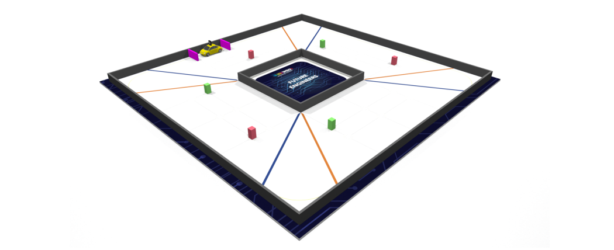
    </td>
  </tr>
</table>

### Difficulties
The obstacle challenge presents many difficult challenges that build onto the open challenge. Although the walls are set at 100cm, steering around the pillar while avoiding walls and detecting turns is difficult to do consistently. 
In order to perform a parallel park the information and car movements must be very precise since the parking lot is only 1.5x the cars size.


### Our Solution
Unlike our open challenge, we used ROS 2 for our obstacle challenge, providing speed and reliability. Another reason comes from the complex nature of the challenge. That is why our strategy involves multiple sensors inputs (camera, imu) and several behaviours (park, navigate). Doing all of this in a single Python script would be slower, harder to maintain, and harder to debug. ROS 2 allows us to use multiple Python scripts (nodes) to communicate to one another with topics. The following is a visualization of the workspace containing all the packages required for ROS 2 to run.
```
~/fe_ws/src/obstacle_challenge/
├── obstacle_challenge/
│   ├── __init__.py
│   ├── camera_node.py
│   ├── imu_node.py
│   ├── navigator_node.py
│   └── ros_robot_controller_sdk.py
├── launch/
│   └── obstacle_challenge_launch.py
├── package.xml
└── setup.py
```

This is a visualziation of how the nodes communicate:


### NODES/TOPICS
#### navigator_node.py
- Core decision making node
- Subscribes to /image_raw from camera_node.py
- Subscribes to /imu_angle from imu_node.py
- Subscribes to /lap_status from imu_node.py
- Subscribes to /ros_robot_controller/button
- Publishes to /state to communicate to other nodes
  Combines camera and IMU data to output driving decisions (turning, avoiding, lap counting, parking).

#### camera_node.py
- Captures frames from the Raspberry Pi's camera
- Subscribes to /state to know what to do
- Publishes to /image_raw to transmit camera information
  Provides visual input for pillar and wall detection


#### imu_node.py
- Reads IMU sensor value and transmits important information
- Subscribes to /imu/rpy/filtered for filtered IMU data
- Publishes to /imu_angle to transmit current IMU angle
- Publishes to /lap_status to transmit lap information
  Provides orientational information for lap counting and navigation

#### ROS2
In short:
navigator_node.py: The brain of the challenge

camera_node.py: The eyes of the challenge

imu_node.py: Balance and lap counting

We like to think of our navigator node as a multi-state machine. It has 5 drive states and 3 pillar states. The 5 drive states are as follows:
1. Button: Wait for button press before starting.
2. Start: Escape from parking lot.
3. Navigate: The main part of challenge, navigate 3 laps around the track.
4. Park: Go into the parking lot.
5. Stop: Stop all movement and nodes.


Since the navigator node is the main for controlling the robot, it must communicate with the other nodes with subscribers and publishers to coordinate current drive and button states.
```
self.create_subscription(Image, '/image_raw', self.camera_callback, 10)
self.create_subscription(Float32, '/imu_angle', self.imu_callback, 10)
self.create_subscription(ButtonState, '/ros_robot_controller/button', self.button_callback, 10)
self.stat_pub = self.create_publisher(String, '/state', 10)
```

#### Camera logic
ROI visualization


The camera logic is largely the same, with the addition of the central ROI and colour detecting HSV ranges.
```
self.left_roi = (0, 220, 180, 150)  # x, y, w, h
self.right_roi = (460, 220, 180, 150)
self.center_roi = (200, 200, 240, 200)

self.lower_red1 = np.array([0, 100, 100])
self.upper_red1 = np.array([10, 255, 255])
self.lower_red2 = np.array([160, 100, 100])
self.upper_red2 = np.array([179, 255, 255])
self.lower_green = np.array([50, 150, 80])
self.upper_green = np.array([95, 255, 255])
self.lower_magenta = np.array([140, 100, 100])
self.upper_magenta = np.array([170, 255, 255])
```

The camera node's job is to publish raw coloured frames to the navigator node in order for it to perform turns.
```
def publish_frame(self):
    frame = self.picam2.capture_array()
        msg = self.bridge.cv2_to_imgmsg(frame, encoding='rgb8')
        self.publisher.publish(msg)
```
The navigator node receives these frames and performs the same logic as the open challenge for black pixels. For the coloured pixels, it performs cropping to focus on a particular ROI, and colour masking to isolate specific pixels. Then the pixels are counted to be used for steering logic.
```
    
gray = cv2.cvtColor(frame, cv2.COLOR_RGB2GRAY)
_, thresh = cv2.threshold(gray, 110, 255, cv2.THRESH_BINARY_INV)

left_crop = thresh[self.left_roi[1]:self.left_roi[1]+self.left_roi[3], 
                   self.left_roi[0]:self.left_roi[0]+self.left_roi[2]]
right_crop = thresh[self.right_roi[1]:self.right_roi[1]+self.right_roi[3], 
                   self.right_roi[0]:self.right_roi[0]+self.right_roi[2]]
front_wall_crop = thresh[self.front_wall_roi[1]:self.front_wall_roi[1]+self.front_wall_roi[3], 
                  self.front_wall_roi[0]:self.front_wall_roi[0]+self.front_wall_roi[2]]
left_wall_crop = thresh[self.left_wall_roi[1]:self.left_wall_roi[1]+self.left_wall_roi[3], 
                   self.left_wall_roi[0]:self.left_wall_roi[0]+self.left_wall_roi[2]]
right_wall_crop = thresh[self.right_wall_roi[1]:self.right_wall_roi[1]+self.right_wall_roi[3], 
                   self.right_wall_roi[0]:self.right_wall_roi[0]+self.right_wall_roi[2]]
center_color_crop = frame[self.center_roi[1]:self.center_roi[1]+self.center_roi[3], 
                   self.center_roi[0]:self.center_roi[0]+self.center_roi[2]]

self.left_area = cv2.countNonZero(left_crop)
self.right_area = cv2.countNonZero(right_crop)
#pillar steering
self.front_wall_area = cv2.countNonZero(front_wall_crop)
self.left_wall_area = cv2.countNonZero(left_wall_crop)
self.right_wall_area = cv2.countNonZero(right_wall_crop)

hsv_center = cv2.cvtColor(center_color_crop, cv2.COLOR_RGB2HSV)

center_magenta_mask = cv2.inRange(hsv_center, self.lower_magenta, self.upper_magenta)
center_orange_mask = cv2.inRange(hsv_center, self.lower_orange, self.upper_orange)
       
center_green_mask = cv2.inRange(hsv_center, self.lower_green, self.upper_green)
center_red_mask = cv2.bitwise_or(cv2.inRange(hsv_center, self.lower_red1, self.upper_red1), 
                       cv2.inRange(hsv_center, self.lower_red2, self.upper_red2))
center_red_mask = cv2.subtract(center_red_mask, center_magenta_mask)
center_red_mask = cv2.subtract(center_red_mask, center_orange_mask)

# Count pixels
self.center_magenta_area = cv2.countNonZero(center_magenta_mask)
self.center_green_area = cv2.countNonZero(center_green_mask)
self.center_red_area = cv2.countNonZero(center_red_mask)
```

#### Parking lot escape
In order to escape the parking lot, we must determine which side the car is on. We can do this by comparing the amount of black pixels in the left roi with the right roi.
```
if self.mode == "start" and self.parking_side is None:
   if self.left_area > self.right_area:
       self.parking_side = "left"
   elif self.right_area > self.left_area:
       self.parking_side = "right" 
```
#### Pillar detection/Navigation
If the center ROI sees enough pixels of red/green it will stop PD steering and enter the corresponding pillar mode.

```
if self.center_red_area > self.pillar_detection_thresh and self.center_red_area > self.center_green_area:
   self.pillar_mode = "red"
   self.prev_pillar_error = self.center_red_area
   
elif self.center_green_area > self.pillar_detection_thresh and self.center_green_area > self.center_red_area:
   self.pillar_mode = "green"  
   self.prev_pillar_error = self.center_green_area

else:
   #Exit condition
   current_pillar_area = self.center_red_area if self.pillar_mode == "red" else self.center_green_area
   # Use hysteresis to prevent flickering
   if (current_pillar_area < self.pillar_clear_thresh and 
       current_time - self.last_pillar_time > 0.1 and self.pillar_mode is not None):  # Wait 0.5s of low signal
       self.pillar_mode = None
```
For a more accurate estimation of the pillars' location, we must find the x-value of the pillar centroid while the y-value is used for debugging.

```
self.pillar_cx = None  # Reset centroid each frame
self.pillar_cy = None

if self.pillar_mode == "red":
   # Find centroid
   M = cv2.moments(center_red_mask)
   if M["m00"] > 0:
       self.pillar_cx = int(M["m10"] / M["m00"])
       self.pillar_cy = int(M["m01"] / M["m00"])
       self.pillar_cy = self.pillar_cy + self.center_roi[1]

elif self.pillar_mode == "green":
   # Find centroid
   M = cv2.moments(center_green_mask)
   if M["m00"] > 0:
       self.pillar_cx = int(M["m10"] / M["m00"])
       self.pillar_cy = int(M["m01"] / M["m00"])
       self.pillar_cy = self.pillar_cy + self.center_roi[1]
```

You may have also noticed the 3 additional wall rois
```
self.front_wall_roi = (260, 200, 160, 180)    # Upper center for front walls
self.left_wall_roi = (100, 300, 60, 60)     # Left side walls
self.right_wall_roi = (480, 300, 60, 60)   # Right side walls
```
These ROIs are used to prevent hitting a wall in certain cases, primarily if a wall is between the car and a pillar or if the pillar is placed at a 90 degree turning section. The front_wall_roi will detect black in front of the car and trigger a harsh turn according to the pillar colour. Similarly if enough black is detected in the left or right wall roi it will turn the other direction. 
```
#emergency turns within pillar steering logic.
if self.wall_in_front or self.right_wall_close:
   self.angle_pwm = self.max_left
if self.wall_in_front or self.left_wall_close:
   self.angle_pwm = self.max_right
```
#### Steering logic

With the x-value of the centroid value we can steer away from the pillar accurately
```
if self.pillar_cx is not None:  
    if self.pillar_mode == "red":
        error = self.pillar_cx - self.screen_center_x + 225
        steering_adjustment = -error * 1.5  
        self.angle_pwm = self.straight_pwm + steering_adjustment
        
    elif self.pillar_mode == "green":
        error = self.pillar_cx - self.screen_center_x - 225
        steering_adjustment = -error * 1.5
        self.angle_pwm = self.straight_pwm + steering_adjustment
```

Since pillar steering has a higher priority in our code, we will be using pillar steering for a large majority of the challenge. In straight/turn sections without pillars it will default to the same PD steering logic used in the open challenge.

Once 3 laps of navigation have been complete, the imu node sends this information to the navigator node.

```
if self.lap_count >= 3:
    msg_out = Bool()
    msg_out.data = True
    self.lap_done_pub.publish(msg_out)
    self.get_logger().info("3 laps done!")
```
Once the navigator node receives this information it will change it's state
```
def lap_callback(self, msg):
    if msg.data and self.state != "park":
        self.get_logger().info("Received IMU signal: 3 laps complete, switching to parking mode.")
        self.state = "park"
        self.lap_done_time = time.time()
```

#### Parking


## Image Resources


<p><strong>Lidar:</strong> <a href="https://botland.store/laser-scanners-lidar/21991-d500-lidar-kit-stl-19p-laser-scanner-360-degrees-12m-dfrobot-sen0547-6959420922680.html" target="_blank">Click Here</a></p>
<p><strong>WRO Future Engineers Map:</strong> <a href="https://world-robot-olympiad-association.github.io/future-engineers-gs/" target="_blank">Click Here</a></p>
<p><strong>Gens Ace 1300 mAh LiPo Battery:</strong> <a href="https://www.horizonhobby.com/product/7.4v-1300mah-2s-45c-g-tech-smart-lipo-battery-deans/GEA132S45DGT.html" target="_blank">Click Here</a></p>
<p><strong>Wheels:</strong> <a href="https://www.amazon.ca/Abendor-Spoke-Narrow-Aluminum-Wltoys/dp/B09ZYVGYB4?th=1" target="_blank">Click Here</a></p>
<p><strong>Furitek Micro Komodo Motor:</strong> <a href="https://furitek.com/products/furitek-micro-komodo-brushless-motor" target="_blank">Click Here</a></p>
<p><strong>Furitek Lizard Pro ESC:</strong> <a href="https://www.ebay.ca/itm/375134202747" target="_blank">Click Here</a></p>
<p><strong>HS-5055MG Servo:</strong> <a href="http://hitecrcd.com/hs-5055mg-economy-metal-gear-feather-servo/?srsltid=AfmBOoo0ORKOBdJtCO5Ff2-jTYfZHZvQ5dd-1uvEWV_mLB7F7kc2kuc1" target="_blank">Click Here</a></p>
<p><strong>5/Zero Camera:</strong> <a href="https://www.amazon.ca/Raspberry-Camera-Module-OV5647-Sensor/dp/B0D324RKRZ/ref=asc_df_B0D324RKRZ?mcid=1f4518f1a5eb31cd9b4ecd50a233320b&tag=googleshopc0c-20&linkCode=df0&hvadid=742370590059&hvpos=&hvnetw=g&hvrand=8203098550634864157&hvpone=&hvptwo=&hvqmt=&hvdev=c&hvdvcmdl=&hvlocint=&hvlocphy=9000757&hvtargid=pla-2413569233270&psc=1&hvocijid=8203098550634864157-B0D324RKRZ-&hvexpln=0&gad_source=1" target="_blank">Click Here</a></p>
<p><strong>MPU-6050 6-Axis IMU:</strong> <a href="https://www.researchgate.net/figure/MPU6050-MPU6050-sensor-module-is-complete-6-axis-Motion-Tracking-Device-It-combines_fig2_366214205" target="_blank">Click Here</a></p>
<p><strong>Open and Obstacle Challenge Mats (Page 6 and 10):</strong> <a href="https://wro-association.org/wp-content/uploads/WRO-2025-Future-Engineers-Self-Driving-Cars-General-Rules.pdf" target="_blank">Click Here</a></p>


